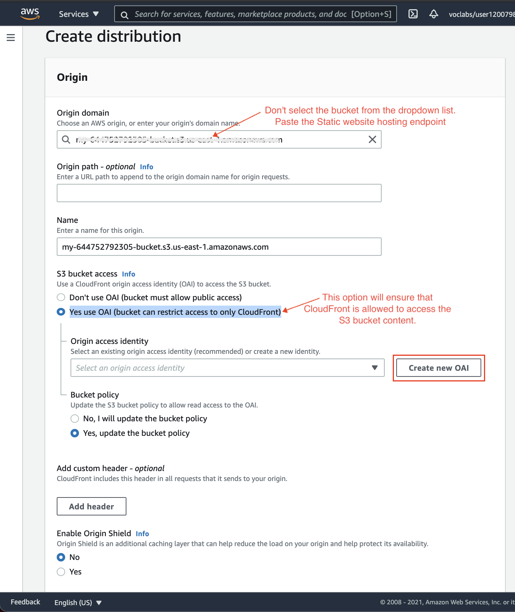
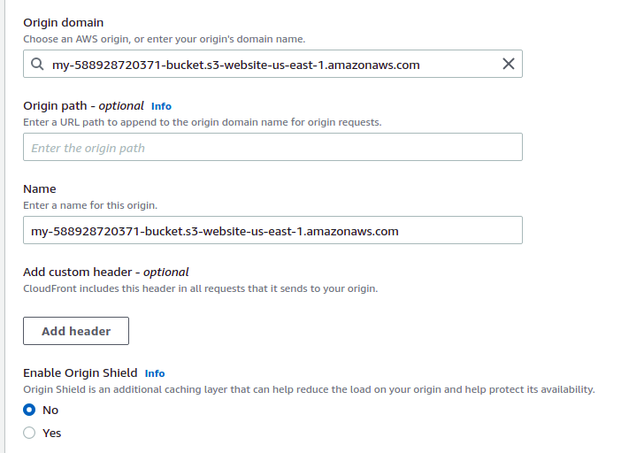

# website url

https://das8nxfrpj4fn.cloudfront.net

http://my-588928720371-bucket.s3-website-us-east-1.amazonaws.com

#Additional Review 

I was confuse about the step to config s3 access policy in cloudfont since it appears only when we choose the s3 in dropdown list.

